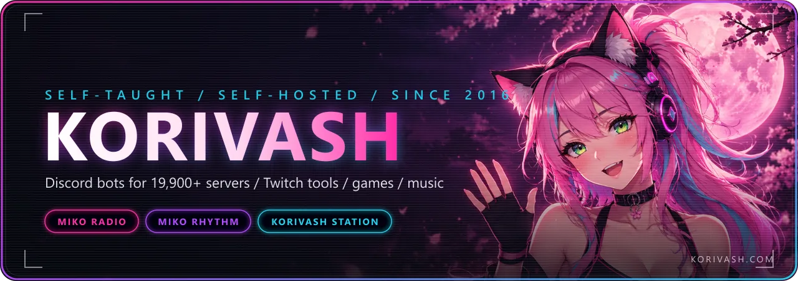
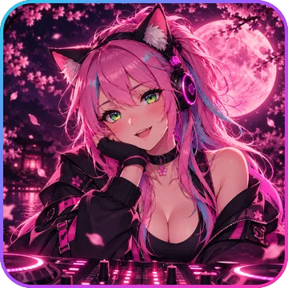
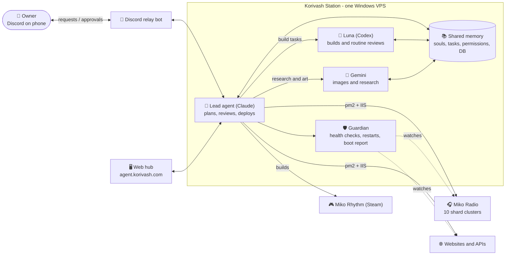
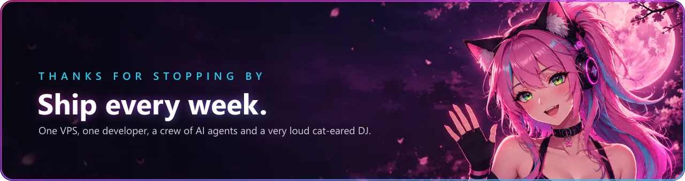

<div align="center">

<a href="https://korivash.com">
  
</a>

<br />

<a href="https://korivash.com">
  
</a>

<br />

[](https://korivash.com)
[](https://discord.gg/YxFRuEPSxZ)
[](https://www.youtube.com/@Korivash)
[](https://twitch.tv/korivash)
[](https://x.com/real_korivash)
[](https://open.spotify.com/artist/48u3iyT7qntFQvwEqBvjBQ)


</div>

<br />

## 📡 Live from the station

<sub>These four cards are **not** stock widgets. They are SVGs my own VPS repaints every 10 minutes from the real production APIs (bot shards, uptime monitors, GitHub), animated, zero JavaScript. If a feed is down the card keeps its last good values instead of going blank.</sub>

<div align="center">

<a href="https://mikoradio.com/status"></a>
<a href="https://mikoradio.com/status"></a>
<a href="https://github.com/Korivash?tab=repositories"></a>
<a href="https://open.spotify.com/artist/48u3iyT7qntFQvwEqBvjBQ"></a>

</div>

<br />

## 👋 About me

<table>
<tr>
<td width="58%" valign="top">

```ts
const korivash = {
  role:      "Self-taught full-stack developer",
  since:     2016,
  builds:    ["Discord bots", "Twitch stream tools",
              "game server infra", "web platforms",
              "rhythm games"],
  runs:      "everything self-hosted on one Windows VPS, 24/7",
  currently: ["Miko Radio", "Miko Rhythm (Steam)",
              "Korivash Station (AI agent crew)"],
  music:     "phonk / wave-trap / anime-inspired, on Spotify",
  motto:     "ship every week",
} as const;
```

</td>
<td width="42%" valign="top">



</td>
</tr>
</table>

<table>
<tr>
<td width="33%" align="center"><br /><b>Self-taught</b><br /><sub>No bootcamp, no degree. Ten years of shipping things people use.</sub></td>
<td width="33%" align="center"><br /><b>Real communities</b><br /><sub>Live Discord servers, Twitch chats and players, not demo accounts.</sub></td>
<td width="33%" align="center"><br /><b>Full-stack, self-hosted</b><br /><sub>Bots, APIs, dashboards, databases, IIS and pm2 on one VPS.</sub></td>
</tr>
</table>

<br />

## 🎧 Miko Radio

<table>
<tr>
<td width="28%" align="center" valign="top">
<a href="https://www.mikoradio.com/"></a>
<br />
<sub><b>Miko</b> - the cat-eared DJ<br />official 2026 art</sub>
</td>
<td width="72%" valign="top">

A Discord music bot in **19,900+ servers** with **1M+ users**, split across **10 sharded clusters** on hardware I run myself. Free for everyone; premium only lifts limits, it never gates the music.

Spotify, Apple Music, YouTube Music, Deezer, SoundCloud and Tidal playback, 20+ audio filters, 24/7 mode, a web dashboard with a drag-to-reorder queue, Last.fm scrobbling, smart autoplay and a built-in Discord Activity.

[](https://mikoradio.com/status)
[](https://mikoradio.com/status)
[](https://mikoradio.com/status)

[](https://discord.com/application-directory/1176036435523022969)
[](https://top.gg/bot/1176036435523022969)
[](https://www.mikoradio.com/)
[](https://www.patreon.com/korivash)

</td>
</tr>
</table>

<details>
<summary><b>Everything Miko can do</b> (click to expand)</summary>

<br />

| Area | What you get |
|---|---|
| **Sources** | Spotify, Apple Music, YouTube Music, Deezer, SoundCloud and Tidal, streamed low-latency through a Lavalink voice cluster. 3.8M+ tracks played |
| **Playback** | 20+ real-time audio filters (8D, bass boost and friends), loop, seek, play-next, replay, lyrics, per-server default volume |
| **24/7 + autoplay** | Keep Miko in voice when the queue ends and let smart autoplay keep the vibe going |
| **Dashboard** | Web control panel at mikoradio.com: playback and volume, drag-to-reorder queue, playlist editor and import, role permissions, request channels |
| **Personal** | Last.fm scrobbling, custom playlists, eleven painted now-playing card themes (Miko changes pose every song), full per-server translations |
| **Activity** | Miko Rhythm runs as a Discord Activity inside the voice channel, synced to what the bot is playing |
| **Scale** | 10 sharded clusters, health endpoint, automatic shard recovery, public status page with 90-day uptime history |
| **Premium** | User, Server and Lifetime tiers (Stripe, Patreon or Ko-fi). Everything core stays free and nothing is locked behind a vote |

</details>

<br />

## 🚀 What I'm building

<table>
<tr>
<td width="33%" align="center" valign="top">
<br />
<b>Miko Rhythm</b><br />
<sub>Four-lane DDR/ITG-style rhythm game heading to Steam: charts from real beat detection, latency calibration, practice mode, a 3D highway and custom arrow skins. Also a Discord Activity inside Miko Radio.</sub>
</td>
<td width="33%" align="center" valign="top">
<a href="https://github.com/Korivash/agent-console-public"></a><br />
<b><a href="https://github.com/Korivash/agent-console-public">Korivash Station</a></b><br />
<sub>AI agents (Claude, Codex, Gemini) with their own roles, memory and permissions that build, review and run my projects 24/7, with a live web hub, a Discord relay and a guardian watching the VPS.</sub>
</td>
<td width="33%" align="center" valign="top">
<a href="https://game.cutecatgirl.com"></a><br />
<b><a href="https://game.cutecatgirl.com">Kitty's Beachball Fantasy</a></b><br />
<sub>3D browser game built for streamer Kittyvenom: campaign, co-op, 2-10 player PvP, accounts, leaderboards and a coin shop. Also a Discord Activity.</sub>
</td>
</tr>
</table>

| | Project | What it is |
|---|---|---|
| 📺 | **Twitch tools** | **Wheel & Reel**: a donation-triggered wheel and slot machine for streamers (StreamElements + bits + chat commands drive an OBS overlay, Helix chat announcements and a MariaDB leaderboard). Plus EventSub integrations and chat bots |
| 🧱 | **Game server infra** | FiveM, Palworld and World of Warcraft tooling: automated backups, DDoS monitoring, Discord bridges, error logging, addons in Lua |
| 🌐 | **Web platforms** | korivash.com, mikoradio.com, cutecatgirl.com: Node/Express APIs, MariaDB, Stripe, admin dashboards, all behind IIS on one box |
| 🎵 | **Music** | Phonk, wave-trap and anime-inspired originals released on [Spotify](https://open.spotify.com/artist/48u3iyT7qntFQvwEqBvjBQ), used as the soundtrack for Miko Rhythm |

<details>
<summary><b>How Korivash Station is wired</b> (architecture diagram)</summary>

<br />



Every agent has a `soul.md` (who it is), `memory.md` (what it learned), `task.md` (what it is doing) and `permissions.md` (what it may touch). The lead never does silent work: every task is visible in the hub and reported back to Discord. The public console lives in [agent-console-public](https://github.com/Korivash/agent-console-public).

</details>

<div align="center">

<br />

<a href="https://github.com/Korivash/agent-console-public"></a>
<a href="https://github.com/Korivash/AutoGitPull"></a>
<a href="https://github.com/Korivash/FiveM-Error-Logs"></a>
<a href="https://github.com/Korivash/mySQL-Autobackup-script"></a>
<a href="https://github.com/Korivash/KeystoneMonitor"></a>
<a href="https://github.com/Korivash/PreyUI"></a>

</div>

<br />

## 🏁 Milestones

<table>
<tr><td>&nbsp; <b>First line of code.</b> Started teaching myself to build the tools my own gaming communities needed.</td></tr>
<tr><td>&nbsp; <b>FiveM era.</b> Ran and tooled game servers: error logging, auto-updaters, backups, Discord webhooks. First public repos.</td></tr>
<tr><td>&nbsp; <b>TypeScript + Discord.</b> Went all-in on Node/TypeScript and Discord.js. Sharded bots, dashboards, Twitch EventSub integrations.</td></tr>
<tr><td>&nbsp; <b>Miko Radio launches.</b> A free music bot with a Lavalink voice cluster, web dashboard and 24/7 radio.</td></tr>
<tr><td>&nbsp; <b>10,000 servers.</b> Miko crosses 10K servers and 10 shard clusters, with a public status page and premium tiers.</td></tr>
<tr><td>&nbsp; <b>Twitch tools, AI, Miko Rhythm.</b> Donation-triggered games and OBS overlays, AI in the build loop, and a rhythm game that started life as a Discord Activity.</td></tr>
<tr><td>&nbsp; <b>Korivash Station + 19.9K servers.</b> A crew of AI agents runs the VPS with me, Miko passes 19,900 servers and 1M users, and Miko Rhythm heads to Steam.</td></tr>
</table>

<br />

## 🧰 Stack

<div align="center">


</div>

<details>
<summary><b>Stack by area</b> (click to expand)</summary>

<br />

| Area | Tools |
|---|---|
| **Discord bots** | TypeScript, Discord.js, Lavalink, Redis, MariaDB/MySQL, sharding + cluster manager, health endpoints, top.gg API |
| **Web & APIs** | Node.js, Express, Next.js, React, Tailwind, Stripe, IIS reverse proxy, Cloudflare, Let's Encrypt |
| **Games** | Three.js, WebGL, Electron, Steamworks, Web Audio beat detection, GSAP, Blender for assets |
| **Twitch & streaming** | Twitch EventSub, Helix API, OBS browser sources, ffmpeg, WebSockets |
| **Game servers** | FiveM (Lua/JS), Palworld, WoW addons (Lua), MySQL backup scripts, DDoS monitoring |
| **Ops** | Windows Server, pm2, IIS, scheduled tasks, Playwright for visual checks, self-hosted github-readme-stats |
| **AI crew** | Claude Code, Codex, Gemini CLI, shared memory files, permission scopes, Discord relay |

</details>

<br />

## 📊 GitHub

<div align="center">


<picture>
  <source media="(prefers-color-scheme: dark)" srcset="https://raw.githubusercontent.com/Korivash/Korivash/output/github-snake-dark.svg" />
  
</picture>

</div>

<br />

## 💛 Support

<sub>Everything above runs on one VPS I pay for. If something I built is useful to you, this keeps the lights on.</sub>

<table>
<tr>
<td width="50%" align="center">
<a href="https://ko-fi.com/korivash"></a><br />
<a href="https://ko-fi.com/korivash"></a>
</td>
<td width="50%" align="center">
<a href="https://korivash.com/donate"></a><br />
<a href="https://korivash.com/donate"></a>
</td>
</tr>
</table>

<div align="center">

<br />

<a href="https://korivash.com"></a>

<sub>Hero, avatar and footer art: official Miko Radio artwork, 2026. Live cards are generated by <code>scripts/readme-cards.mjs</code> in this repo.</sub>

</div>
